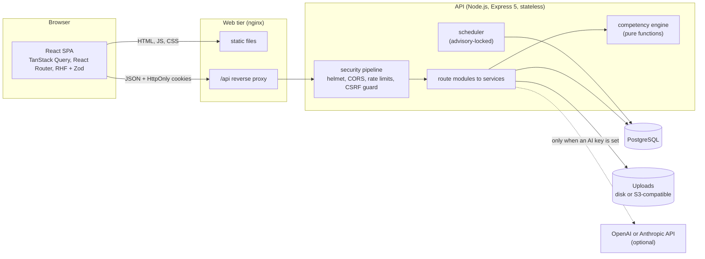

# Architecture

Capacity Connect is a three-tier web application: a React single-page app, a stateless Node.js API and PostgreSQL. The web
app and the API deploy independently. The competency logic is a set of pure functions that both the API and the tests call
directly; nothing in it depends on the web framework or the database.



## Repository layout

```
backend/            Express API (TypeScript)
  src/app.ts          middleware pipeline; server.ts binds it to a port and handles shutdown
  src/routes.ts       mounts every module under /api
  src/modules/        one folder per feature: routes (thin) + services (logic) + schemas (Zod)
  src/middleware/     authenticate / requireRole, CSRF guard, rate limiters, uploads, error handler
  src/services/       cross-cutting: audit log, notifications, scheduler, file storage (disk / S3)
  src/lib/            errors, response envelope, Prisma client, shared schemas, crypto
  src/cli/            operator commands (create the first administrator)
  scripts/            list-routes.ts: prints (and checks docs/api.md against) every registered route
  tests/              unit (pure logic), integration (real HTTP + PostgreSQL)
frontend/           React SPA (TypeScript, Vite, Tailwind)
  src/pages/          screens per workspace: trainee, trainer, admin, shared, auth, public
  src/components/     ui/ (design-system primitives) and domain/ (feature components)
  src/services/       typed API calls; src/api/ HTTP client, query keys, query client
  src/charts/         Recharts wrappers; src/hooks/ auth and shared hooks
  nginx/              production web server template
prisma/             schema, migrations, deterministic demo seed
docs/               this documentation
```

## Backend

### Request pipeline

`app.ts` builds the Express app (no listening socket, so tests drive it in-process with Supertest). Every request passes,
in order:

1. `requestId`: a UUID for the request, echoed as `X-Request-Id` and attached to the log line.
2. `pino-http`: structured JSON access log (`/api/health` is not logged).
3. `helmet`: security headers, with a strict `default-src 'none'` policy (the API only returns JSON and files).
4. `cors`: only the origins in `FRONTEND_URL`, with credentials.
5. `express.json` (1 MB limit) and `cookie-parser`.
6. `/api` only: `Cache-Control: no-store` → the global rate limiter → the CSRF guard → the routers.
7. `notFoundHandler`, then `errorHandler`, which turns every error into the standard envelope.

### Modules

Each feature is a folder with the same three layers, so a change has an obvious home:

| Layer | Responsibility | Rule |
|---|---|---|
| `*.routes.ts` | HTTP: parse and validate input, authenticate, check the role, call one service, wrap the result | no business logic, no Prisma calls beyond trivial reads |
| `*.service.ts` | Business rules, record-level authorisation, transactions, audit entries | takes the acting user explicitly; throws `AppError` |
| `*.schemas.ts` | Zod schemas for request bodies and queries | `strictObject`: unknown fields are rejected |

Modules: `auth`, `users` (accounts, profile), `departments`, `roles` (job roles and their competency requirements),
`competencies` (framework, engine, passport, skill gaps, evidence), `recommendations`, `courses` (catalogue, authoring, insights),
`enrollments`, `assessments` (authoring, attempts, scoring), `certificates` (issue, PDF, QR, verification), `evaluations`
(trainer rubric), `dashboard`, `achievements`, `notifications`, `announcements`, `reminders`, `analytics` (heatmap, training needs),
`search`, `meta` (public options), and `ai` (the optional Phase 2 features and the forecast).

### The competency engine

`modules/competencies/engine/` contains only pure functions: gap and priority calculation, the update rule, the evaluation
score, the recommendation and learning-path builder. They take plain data plus an `EngineConfig` and return plain data, so
they are tested without a database and their behaviour is fully described in [competency-engine.md](competency-engine.md). The
services around them (`evidence.service.ts`, `skill-gaps.routes.ts`, `recommendation.service.ts`) load inputs, call the
functions and persist the outcome. The configuration is stored in `SystemSetting` and merged over the defaults on read.

### Consistency: what is atomic

A submitted assessment is the central write, and it is one database transaction
(`assessments/attempts.service.ts`):

1. the attempt is *claimed* with `UPDATE ... WHERE status = 'IN_PROGRESS'`, so a double submit or a race cannot score twice;
2. the answers are stored, scored against the question bank on the server (the client never sends or sees a score);
3. on a pass, the certificate is issued and the enrollment moves to `CERTIFIED` or `COMPLETED`;
4. the competency engine gathers all valid evidence, blends it with the previous level and writes the new level **and** the
   history row.

Only after the commit come the side effects that must not undo a scored result: notifications (idempotent through
`dedupeKey`), the audit entry and achievement checks. Time limits are enforced by the server (`expiresAt`): a late submission
is refused and counts as an attempt.

### Files

Uploads are validated by content (magic bytes), never by the client's MIME type or extension, and stored through a provider
interface with two implementations: local disk (development, single node) and any S3-compatible bucket. Downloads always go
through the API: it checks who may see the file, then either streams it from disk (with Range support for video seeking) or
redirects to a short-lived pre-signed URL. Certificates are rendered on demand with PDFKit, including a QR code to the public
verification page.

### Background work

Reminders (approaching deadlines, stalled learners, unaddressed high-priority gaps) run in an in-process scheduler every six
hours when `ENABLE_SCHEDULER=true`. The job runs inside a PostgreSQL advisory lock, so with several API instances only one runs
it, and its notifications carry a dedupe key, so running it twice never notifies twice. An administrator can also trigger it
(`POST /api/admin/jobs/reminders`), for example from an external cron.

### Errors, logging, audit

Every failure is an `AppError` with a status, a stable `code` and a safe message; anything else is a `500` with a generic message
(details go to the log with the request id). Logs are JSON (`pino`), never contain passwords, tokens or AI prompts. Security-
and governance-relevant actions are appended to `AuditLog` (who, what, on which record, from which IP); an audit failure is
logged but never breaks the operation it describes.

## Frontend

* **Routing.** Every page is code-split. Three workspaces (`/trainee`, `/trainer`, `/admin`) sit behind route guards that
  mirror the server's rules; the API remains the authority, and a forbidden page is shown if a role opens a foreign URL.
* **Server state.** All server data lives in TanStack Query with a central query-key factory (`api/keys.ts`), so a mutation
  invalidates exactly what it changed. A `useApiMutation` helper gives every write the same toast, invalidation and visible
  error handling; `QueryBoundary` gives every read the same loading, error and retry states.
* **Auth.** The session is the pair of HttpOnly cookies; the app only knows *who* is signed in (`GET /api/users/me`). The API
  client refreshes an expired access token once for all concurrent requests, and a failed refresh returns the user to sign-in.
* **Forms.** React Hook Form with Zod schemas that mirror the server's rules; server validation errors are shown next to the
  fields.
* **Design system.** `components/ui` holds the primitives (buttons, fields, cards, tables, dialogs, toasts) so screens do not
  restyle them; `components/domain` holds feature components (Competency Passport, course cards, assessment review).
* **Accessibility.** Semantic HTML with landmarks and one level-one heading per page, labelled controls, focus-managed dialogs,
  live regions for async results, real tab panels, tables with captions whose scroll area the keyboard can reach, and charts
  that sit next to the same figures as text or tables. Text meets WCAG AA contrast (4.5:1): the Tailwind theme has separate text
  colours (`sky-deep`, `teal-deep` on light surfaces, `sky-light` on navy) next to the plain brand colours used for fills, and the
  heatmap chooses its text colour from the measured contrast (`utils/constants.ts`, tested for every value). An automated axe-core
  scan of 31 screens at desktop and phone width came back clean; that is not a substitute for testing with assistive technology.
* **Errors.** An error boundary around every page (and the whole app) keeps a rendering failure from blanking the screen.

## Optional AI features

The AI module (`modules/ai`) is deliberately walled off from the framework. One client (`ai.client.ts`) is the only code that
talks to an AI provider: `AI_PROVIDER` picks the OpenAI adapter (GPT models, the default; it also works with any
OpenAI-compatible service through `OPENAI_BASE_URL`; `ai.openai.ts`) or the Anthropic one. Every feature asks for **structured
output** validated by a Zod schema, and everything that comes back is treated as untrusted input and checked against the
database before it is used. Without a key the generative endpoints answer `503` and the platform is unchanged. See [api.md](api.md#ai-features) for the behaviour and
[security.md](security.md#optional-ai-features) for the data flow.

## Key decisions

| Decision | Why |
|---|---|
| Deterministic engine, AI only around it | Government training records must be explainable and reproducible; a model may word a result but never produce one |
| Sessions in HttpOnly cookies, refresh-token rotation | Tokens are unreachable to injected script; theft of a refresh token is detectable |
| Custom-header CSRF protection instead of tokens | No server-side token store; a cross-site page cannot add the header without a refused CORS pre-flight |
| Authorisation on the server per route *and* per record | The UI is never the access control |
| Soft delete for users and courses | Certificates, attempts and the audit trail must keep their references |
| Append-only history and audit tables | The Competency Passport and the forecast are built from real events, not overwritten state |
| One PostgreSQL, no queue or cache | Fewer moving parts; the API is stateless so it scales by adding instances (see [deployment.md](deployment.md)) |
| Prisma migrations + SQL `CHECK` constraints | Schema changes are reviewed and repeatable, and the database itself refuses out-of-range levels |
| Contract-first documentation checked by tooling | `npm run routes -- --check` fails CI when `docs/api.md` and the routes diverge |
