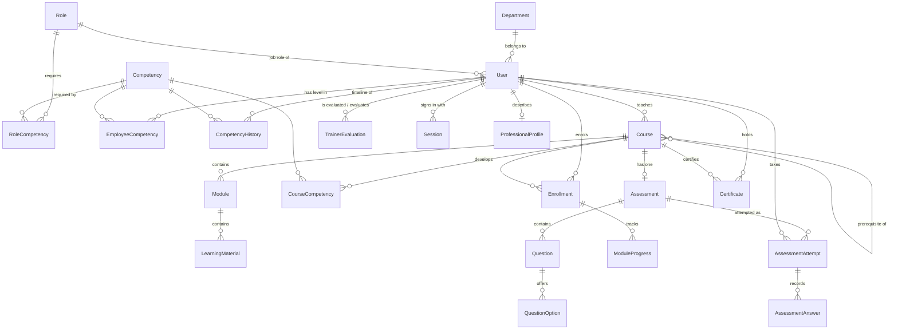

# Database

PostgreSQL is the only datastore. The schema is defined in [`prisma/schema.prisma`](../prisma/schema.prisma) and evolved with
Prisma migrations ([`prisma/migrations/`](../prisma/migrations)); the API talks to it through Prisma Client, with a small
amount of parameterised raw SQL for analytics that the query builder cannot express (heatmap, history replay, forecast).

* 48 tables, 24 enums, UUID primary keys, all timestamps stored as UTC (`timestamp(3)`).
* Competency levels are integers from 0 to 100 everywhere; ranges are enforced by the database itself (see
  [Integrity rules](#integrity-rules)), not only by the application.
* `UserRole` (enum: TRAINEE, TRAINER, ADMIN) is the *access* role used for authorisation. `Role` (table) is the
  *organisational job role* ("Severe Weather Forecaster") that carries the competency requirements. The two are deliberately
  different things; the names are documented at the top of the schema file.

## Entity relationships



## Tables

### Organisation and accounts

| Table | Purpose | Notes |
|---|---|---|
| `Department` | Organisational unit (Forecasting, Radar Operations, ...) | unique `name` and `code`; `isActive` hides it without deleting history |
| `Role` | Job role / designation | `criticality` 1 to 5 multiplies into the training priority |
| `User` | Every account | unique lower-case `email`; `role` (access), `status` (PENDING, ACTIVE, REJECTED, SUSPENDED), `mustChangePassword`, `failedLoginCount`, `lockedUntil`; **soft delete** through `deletedAt` (the row stays so attempts, certificates and the audit log keep their references, and unique fields are released) |
| `Session` | One row per signed-in device | stores only the SHA-256 of the refresh token and of the previous one (reuse detection); user agent, IP, expiry, revocation |
| `ProfessionalProfile`, `Qualification`, `WorkExperience`, `ProfileSkill` | Self-maintained profile | skills are informational; verified competency lives elsewhere |

### Competency framework

| Table | Purpose | Notes |
|---|---|---|
| `Competency` | A skill area (Radar Meteorology, ...) | unique `code` and `name`; optional `levelDescriptors` |
| `RoleCompetency` | What a job role requires | `requiredLevel` 0 to 100, `importance` 1 to 5; unique per role and competency |
| `EmployeeCompetency` | Current verified level of an employee | unique per user and competency; indexed by `(competencyId, currentLevel)` for the organisation views. `currentLevel` is the **verified baseline**; the *effective* level after decay is derived at read time and never stored. `lastPracticedAt` resets decay, `lastEvidenceAt` resets recertification |
| `CompetencyHistory` | **Append-only** timeline of every change | `previousLevel`, `newLevel`, `source`, the course / attempt / evaluation that caused it, and a `details` JSON with the formula inputs so every change can be explained |

### Courses and learning

| Table | Purpose | Notes |
|---|---|---|
| `Course` | A course | `status` DRAFT / PUBLISHED / ARCHIVED, `difficulty`, `passingScore`, `trainerId`, `deletedAt` (soft delete) |
| `CourseCompetency` | Which competency band a course develops | `levelFrom` to `levelTo`; the engine uses `levelTo` as the ceiling a course can certify |
| `CoursePrerequisite` | Course to course prerequisites | composite key; cycles are guarded in the path builder |
| `Module`, `LearningMaterial` | Course content | material types VIDEO, DOCUMENT, LINK, TEXT; `extractedText` holds readable text of uploaded documents (searchable, and the only thing the optional AI assistant reads) |
| `Enrollment` | A learner in a course | unique per user and course; `status` ENROLLED, IN_PROGRESS, ASSESSMENT_PENDING, COMPLETED, CERTIFIED, WITHDRAWN; `progress` is a denormalised percentage |
| `ModuleProgress` | Which modules a learner finished | unique per enrollment and module |

### Assessment and certification

| Table | Purpose | Notes |
|---|---|---|
| `Assessment` | One per course | pass mark, time limit, attempts (0 = unlimited), deadline, `questionsPerAttempt` (random draw), shuffle and review switches; `mcqWeight` splits the final mark between the questions and the practical component (1 = questions only) |
| `Question`, `QuestionOption` | The question bank | SINGLE or MULTIPLE answer; marks at least 1 (the API allows up to 20) |
| `PracticalScenario` | A situation a trainee works through | `briefing`, optional `imageUrl`, `marks` (the sum of its steps), ordered by `position` within an assessment |
| `PracticalScenarioStep` | One decision inside a scenario | `type` IDENTIFY / INTERPRET / ACTION; `marks`; an `explanation` shown after submission whatever was chosen |
| `PracticalScenarioOption` | A choice for a step | `credit` 0..1 - unlike a quiz option a choice can be **partly right**, so a defensible but slower decision earns part of the marks; `rationale` explains what it earns and why |
| `PracticalResponse` | What one trainee chose, in one attempt | unique per attempt and step; stores `creditAwarded` and `marksAwarded` so a past result stays explainable even if the scenario is rewritten |
| `AssessmentAttempt` | One try | `questionOrder` fixes the draw and order; server-side `expiresAt` for timed attempts; `score`, `percentage`, `passed`, and `mcqPercentage` / `practicalPercentage` when the assessment has both halves; unique per assessment, user and attempt number. `idempotencyKey` is unique per user, so a submission replayed after a dropped connection returns the original result instead of costing an attempt |
| `AssessmentAnswer` | The selected options and marks awarded | unique per attempt and question |
| `Certificate` | An issued certificate | public `certificateNumber`; **snapshots** of holder name, course title, issuer and `signedCompetencies` so it stays stable if a record is edited later; `status` VALID or REVOKED; one per user and course. `signature`, `signatureKeyId` and `signedAt` hold the Ed25519 signature over the canonical payload; a certificate issued while no key was configured is simply unsigned, and verification says so |
| `Feedback` | Course and trainer rating | unique per user and course |
| `TrainerEvaluation` | The weighted rubric | five ratings 1 to 5, the resulting `weightedScore` and the `weightsUsed` in force at the time |

### Operational readiness

Competency freshness is a **pure function of a date**: nothing in this group stores a decayed level, and no readiness query
writes anything. That is what makes the simulation ("show me the workforce in 180 days") safe.

| Table | Purpose | Notes |
|---|---|---|
| `CompetencyDecayPolicy` | How one competency fades | `halfLifeDays`, `minimumSafeLevel`, `recertificationIntervalDays`, `criticality`, and `decayEnabled`. **Opt-in**: a competency with no row here does not decay, expire or have a minimum safe level, so an existing installation behaves exactly as before. `isSimulation` marks the demonstration values, which the interface labels as such |
| `CompetencyPracticeRecord` | Evidence that a competency was used | `source` (duty, exercise, course, assessment, mentoring, manual) with a date and optional note; recording practice moves `EmployeeCompetency.lastPracticedAt` and so resets decay, but never changes the verified level |
| `Mentorship` | An expert paired with somebody developing a competency | `status` NOT_STARTED / ACTIVE / COMPLETED / CANCELLED; a record of intent, not an automated transfer of expertise |
| `ReadinessEvent` | An operational period to be ready for | `hazardType`, start and end dates, `priority`, `status`; `isSimulation` marks demonstration events |
| `ReadinessRequirement` | What an event needs | competency, `requiredLevel` and `importance`; readiness is the weighted share of these met **at the event's start date** |
| `ReadinessEventDepartment` | Who the event applies to | no rows means the whole active workforce |
| `ReadinessAssignment` | Preparation given to a person | unique per event, user and competency, so assigning again is idempotent; `status` ASSIGNED / IN_PROGRESS / COMPLETED / WAIVED |

`User` also carries `retirementDate` and `careerLevel`, which are what the knowledge-continuity analysis uses. It reports where
too few people hold a competency; it does **not** predict who will actually leave.

### AR Instrument Lab

A practical taken against a 3D model. The marking lives in these tables, never in the browser: a submission names the
components the trainee selected, and the server compares them with `ARTask.correctComponentId`.

| Table | Purpose | Notes |
|---|---|---|
| `ARModule` | One instrument lab | `key` matches the seed and deep links; `modelUrl` points at a `.glb` whose provenance is in [AR_ASSETS.md](AR_ASSETS.md); `kind` FULL_LAB or REFRESHER, a refresher pointing at its parent; `theoryWeight` splits the combined score between the theory assessment and the practical; `isSimulation` marks demonstration content |
| `ARComponent` | A part of the instrument | `key` matches the node **and material** name in the .glb, which is how the viewer highlights exactly one part; `hotspotPosition` places the tappable marker in model space; scenery is `isInteractive: false` |
| `ARTask` | One thing the trainee is asked to do | `phase` TRAINING (hints shown, nothing scored) or ASSESSMENT (no hints, scored); `correctComponentId` is the answer and never leaves the server while an attempt is open |
| `ARPracticalAttempt` | One run of a practical | `practicalPercentage` from the points, `theoryPercentage` snapshotted at submission, `combinedPercentage` from the module's weighting, and `competencyBefore` / `competencyAfter` so a trainer can see what it changed. `idempotencyKey` is unique per user, so a replayed submission returns the original result |
| `ARTaskResponse` | What was selected for one task | unique per attempt and task; stores the marks awarded so a past result stays explainable if the lab is later rewritten |

The practical does **not** set a competency level. It is applied through the same evidence service as everything else, which
blends the previous level with all current evidence; the engine's notion of "practical evidence" is the more recent of a
trainer evaluation of type PRACTICAL and a completed AR attempt. Completing a lab also records a `CompetencyPracticeRecord`,
so it resets freshness as well as contributing evidence.

### Engagement and governance

| Table | Purpose | Notes |
|---|---|---|
| `Notification` | In-app notifications | `dedupeKey` (unique per user) makes scheduled jobs idempotent |
| `Announcement` | Broadcasts | audience ALL / TRAINEES / TRAINERS / ADMINS, optionally one department, optional expiry |
| `Achievement` | Badges earned | unique per user and badge code |
| `AuditLog` | Who did what, when | append-only; user, action, entity, metadata, IP and user agent |
| `SystemSetting` | Runtime configuration | key / value JSON; holds `engine.config` (the competency engine settings) |

## Integrity rules

Prisma's schema language cannot express `CHECK` constraints, so the migration
`20260920172500_data_integrity_constraints` adds them in SQL. The database therefore refuses, whatever code calls it:

* competency levels outside 0 to 100 (`RoleCompetency.requiredLevel`, `EmployeeCompetency.currentLevel`, both levels of
  `CompetencyHistory`) and course mappings where `levelTo` is not greater than `levelFrom`;
* importance, criticality, proficiency, feedback and rubric ratings outside their 1 to 5 scales, and a weighted evaluation
  score outside 0 to 100;
* pass marks outside 1 to 100, negative durations, positions or attempt counts, non-positive time limits, question marks
  below 1, progress outside 0 to 100;
* an e-mail address that is not lower case (so the unique index really is case-insensitive).

Other guarantees come from unique constraints (one enrollment, certificate and feedback per person and course, one
achievement per badge, one attempt number per person and assessment), foreign keys (children of a deleted course, module, assessment or user
cascade; references from historical records such as certificates to their user and course do not, which is why users and
courses are **soft deleted**), and transactions: a submitted attempt, the competency update, its history row and the
certificate are written together or not at all.

## Indexes

Indexes follow the queries the screens actually run: `(userId, competencyId, createdAt)` on `CompetencyHistory` (timelines
and the forecast), `(competencyId, currentLevel)` on `EmployeeCompetency` (heatmap), `(courseId, status)` and
`(userId, status)` on `Enrollment`, `(assessmentId, status)` and `(userId, submittedAt)` on `AssessmentAttempt`,
`(userId, isRead, createdAt)` on `Notification`, and `createdAt`, `userId`, `(entityType, entityId)` and `action` on
`AuditLog` (the audit screen's filters).

## Migrations

| Migration | What it does |
|---|---|
| `20260920171757_init` | All tables, enums, unique constraints, foreign keys and indexes |
| `20260920172500_data_integrity_constraints` | The `CHECK` constraints above |
| `20260920174201_notification_achievement_and_material_text` | Notification idempotency key, achievements, and extracted text of uploaded materials |
| `20260921142104_competency_decay_and_practice` | `CompetencyDecayPolicy`, `CompetencyPracticeRecord`, and the two dates on `EmployeeCompetency` |
| `20260921151528_succession_and_mentorship` | `Mentorship`, and `retirementDate` / `careerLevel` on `User` |
| `20260921152540_signed_certificates` | Ed25519 `signature`, `signatureKeyId` and `signedAt` on `Certificate` |
| `20260921154038_readiness_events` | `ReadinessEvent`, `ReadinessRequirement`, `ReadinessEventDepartment`, `ReadinessAssignment` |
| `20260921155220_practical_assessment` | `PracticalScenario`, its steps, options and responses, and the practical half of an attempt |
| `20260921212557_submission_idempotency` | `idempotencyKey`, unique per user, on `AssessmentAttempt` |
| `20260922053021_ar_instrument_lab` | `ARModule`, `ARComponent`, `ARTask`, `ARPracticalAttempt`, `ARTaskResponse` |

```bash
npm run db:migrate         # development: create and apply a new migration from schema.prisma
npm run db:deploy          # production / CI: apply the committed migrations, never generates new ones
npm run db:generate        # regenerate Prisma Client after a schema change
```

Rules of thumb: never edit a migration that has been applied anywhere; prefer additive, backward-compatible changes
(add a nullable column, backfill, then tighten) so the running API keeps working during a rolling deploy; write destructive
changes in two releases. `npm run db:reset` **wipes the database**: use it in development only.

## Demo data

`npm run db:seed` (development only: it refuses `NODE_ENV=production` unless `ALLOW_PRODUCTION_SEED=true`) creates a
realistic, deterministic dataset. It does not just insert rows: a year of learning activity is *replayed in chronological
order through the real competency engine*, so every level, history entry and timeline in the demo is exactly what the
platform would have produced itself. Roughly:

| | |
|---|---|
| Framework | 7 departments, 9 job roles, 8 competencies, 41 role requirements |
| People | about 50 accounts: 4 trainers, 2 administrators and about 45 trainees (including 3 pending approval and 1 suspended, to demonstrate the workflow), with profiles, qualifications and skills |
| Learning | 15 published courses (plus a draft and an archived one), about 60 modules and 90 materials, 15 assessments with about 130 questions, prerequisite chains such as Radar Fundamentals → Doppler Radar Analysis → Advanced Radar Analysis |
| Activity | about 100 enrollments and attempts over the past year, certificates, feedback, trainer evaluations, notifications, achievements, announcements |

`SEED_DEMO_PASSWORD` sets the password of every demo account (`trainee@`, `trainer@` and `admin@imd.gov.in` are the three
headline logins). `npm run db:seed -- --reset` empties the application tables first. Production never uses the seed: create the
first administrator with `npm run admin:create` (see [deployment.md](deployment.md)).

## Personal data

The tables that hold personal data are `User` (name, e-mail, phone, employee id, designation, location), the profile tables,
`Session` (IP address and user agent), `AuditLog` (IP address and user agent) and `Notification`. Passwords are stored only as
Argon2id hashes and refresh tokens only as SHA-256 hashes. Public certificate verification exposes only what is printed on the
certificate (holder name, course title, score, date, issuer). A user is soft deleted, which keeps records that must stay
intact (certificates, audit trail) while releasing the e-mail address and employee id; an organisation that must erase
personal data entirely should anonymise the row rather than remove it.

## Backup and recovery

Use the managed database's point-in-time recovery, or schedule `pg_dump --format=custom` and test the restore. Uploaded
files live outside the database (local disk or an S3-compatible bucket, see [deployment.md](deployment.md)) and must be
backed up with it: the two together are the system's state. Migrations are forward-only; recover a bad release by restoring
a backup, not by trying to reverse a migration.
